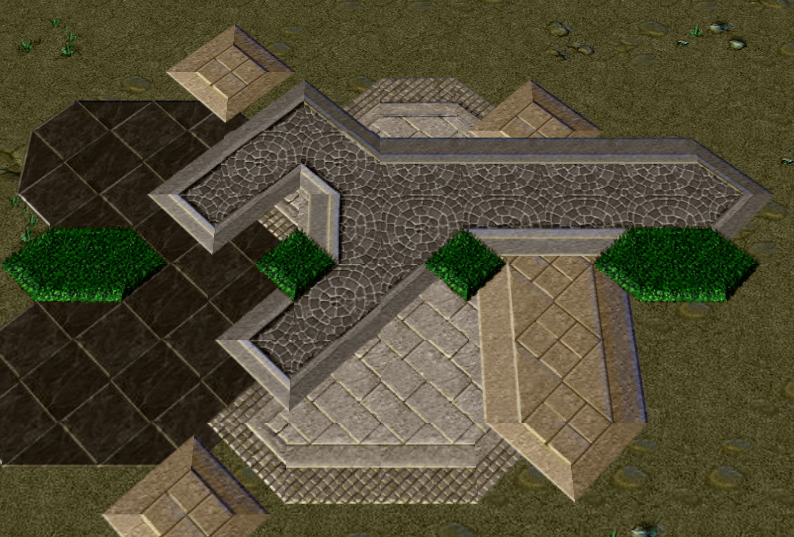
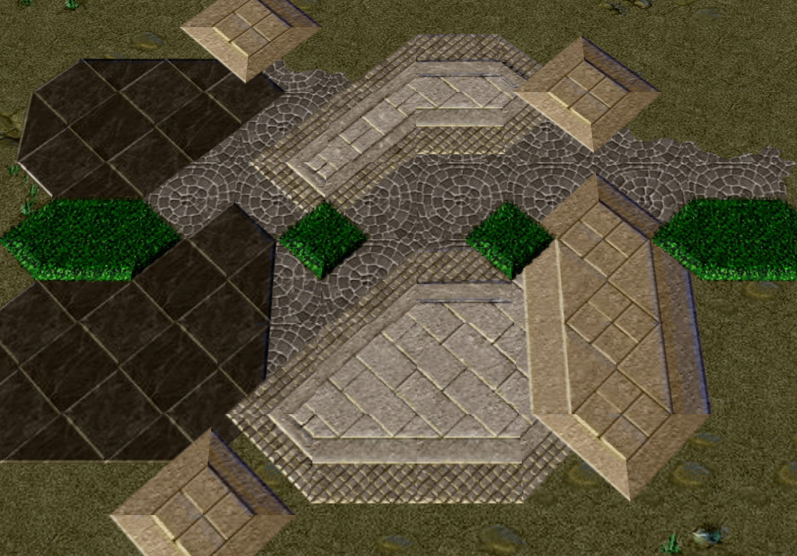
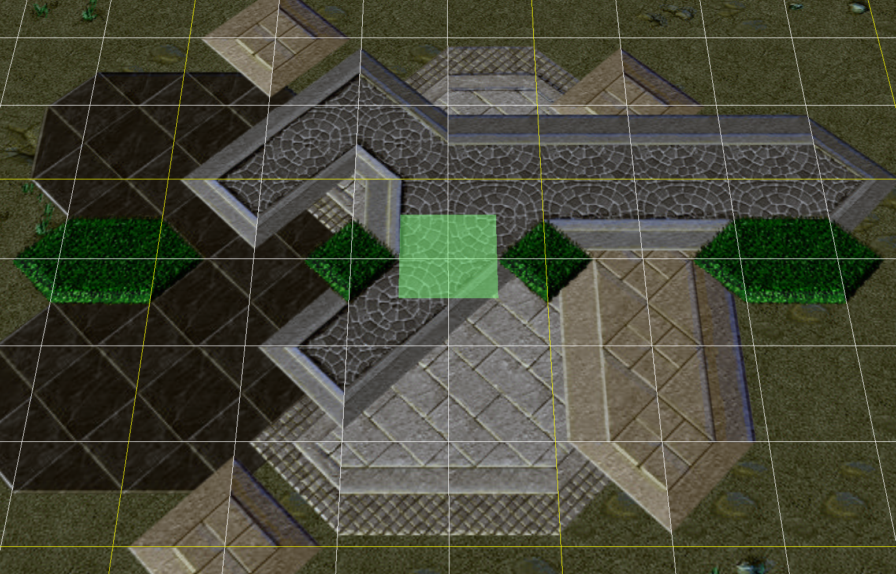
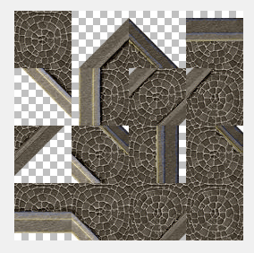
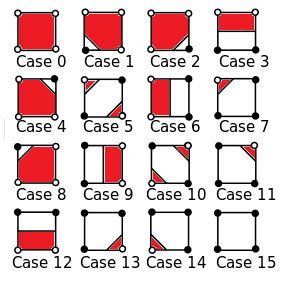
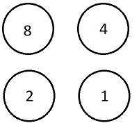
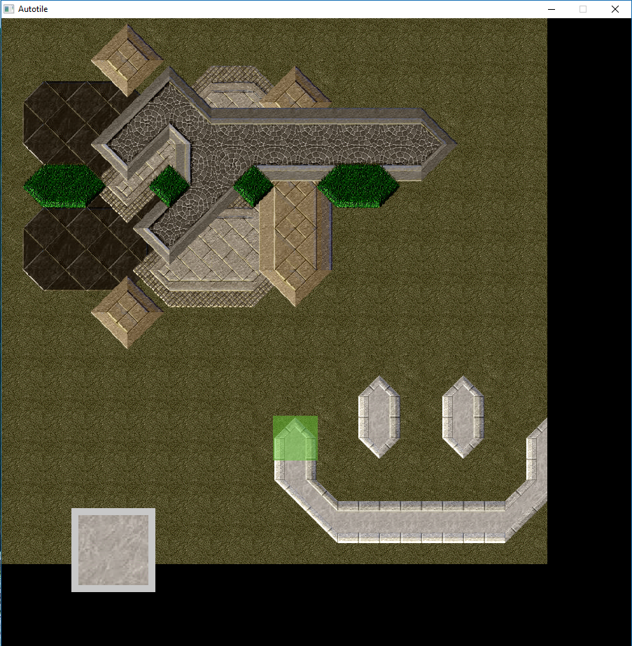

# Running
Written in Go. Requires SDL2 and SDL2-img libraries.
Number keys select tile. click to place.

# Writeup
Warcraft 3 autotiling looks great, so I tried to reverse engineer it. Here are some samples:

Changing the order of the round tiles to be the lowest:

Here is what one of these textures looks like:

Lets list some of the visible implementation details:
* Tiles are ordered, like I alluded above. The order determines who's transitions will be drawn on top
* The tile on the bottom fills out the square
* Tiles are stored at vertexes of the grid, grid 'faces' are drawn according to what tiles are on their vertices
* Marching squares is used to determine which tile(s) to draw
* Marching squares distinguishes between only 'same tile' and 'different tile' for each case

To give a quick rundown of marching squares. Consider that the grid is made up of vertices and 4 vertices share each face, and we are figuring out how how to draw each face from its vertices.

In this figure, a white vertex means 'chosen tile' and black vertex means 'other tile'. Red area is how we would draw 'chosen tile' for that configuration of vertices.

We have enumerated all possible cases. It is easy to number them in binary by assigning a bit position to each vertex. Calculating the right representation is then reduced to looking up a 4-bit number.

You will notice that this example looks similar to the game texture above. The differences are only because the vertices are numbered differently, like so:

nb. a binary '1' means 'chosen tile' in that position
binary '0' means 'other tile' in that position

Take another look at the sprite sheet and it will (hopefully) make sense.

In summary, drawing the appropriate tile means:
1. Represent the vertices as a 4 bit number *i*
2. Draw *i*th tile from the sprite sheet

Most of the work is simply done by ordering the sprites a certain way.

The way the tiles are actually composed into the graphic in the game is also pretty simple.
* For each face on the game grid:
  * Consider each face and its 4 vertices. First draw the 'lowest' height tile's flat representation
  * For the remaining vertices, in order of ascending height, draw the appropriate representation based on marching squares (as above)

Remembering that 'tile height' is pre-determined in some arbitrary way.

Here's the result I got:

